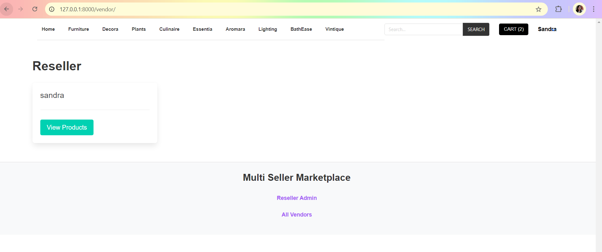

# ResellerWeb
This is a simple Multi-Reseller e-commerce website built with Django (Python) and Stripe added as the payment processor.

Django Simple Multi-Reseller Website with Payment
This is a simple Multi-Reseller e-commerce website built with Django (Python) and Stripe added as the payment processor.

In this website, Resellers (Stores) can register and add their products. Users can visit the products and order them by paying with a Debit/Credit Card (Stripe is used). The Reseller then gets an email notification about the order and should deliver the product to the customer based on the address details.

Features of this Project
A. Admin Users Can:
Manage Category (Add, Update, Filter, and Delete)
Manage Products (Add, Update, Filter, and Delete)
Manage Users (Update, Filter, and Delete)
Manage Orders (View and Process)
B. Resellers Can:
Add Products
Update Profile
Get Notifications When an Order is made by Users
Get Orders and Manage Them
C. Users Can:
Add to Cart
Pay with Debit/Credit Card and Order
While Checkout, provide the address for delivery
Get Email Notification about the confirmation of the order

Installation:
Create a Folder where you want to save the project.

Create a Virtual Environment and Activate:

Install Virtual Environment First:

bash
Copy code
pip install virtualenv
Create Virtual Environment:

For Windows:

bash
Copy code
python -m venv venv
For Mac:

bash
Copy code
python3 -m venv venv
Activate Virtual Environment:

For Windows:

bash
Copy code
source venv/scripts/activate
For Mac:

bash
Copy code
source venv/bin/activate
Clone this Project:

bash
Copy code
git clone https://github.com/vijaythapa333/simple-multivendor-site.git
Then, Enter the Project:

bash
Copy code
cd simple-multivendor-site
Install Requirements from 'requirements.txt':

bash
Copy code
pip install -r requirements.txt
Add the Hosts:

Go to the settings.py file, then on allowed hosts, add ['*'].

python
Copy code
ALLOWED_HOSTS = ['*']
No need to change on Mac.

Run the Server:

Command for PC:

bash
Copy code
python manage.py runserver
Command for Mac:

bash
Copy code
python3 manage.py runserver
Login Credentials:

Create Super User (Admin):

Command for PC:

bash
Copy code
python manage.py createsuperuser
Command for Mac:

bash
Copy code
python3 manage.py createsuperuser
Then Add Email, Username, and Password.

This README file provides a complete overview and instructions for your Django Multi-Reseller Website project.
